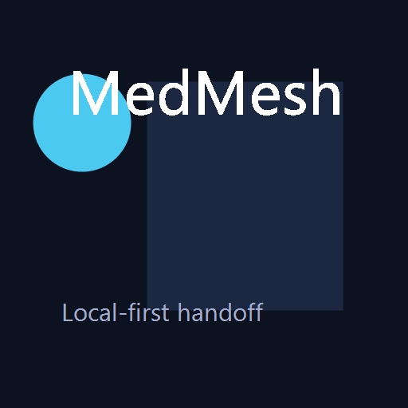
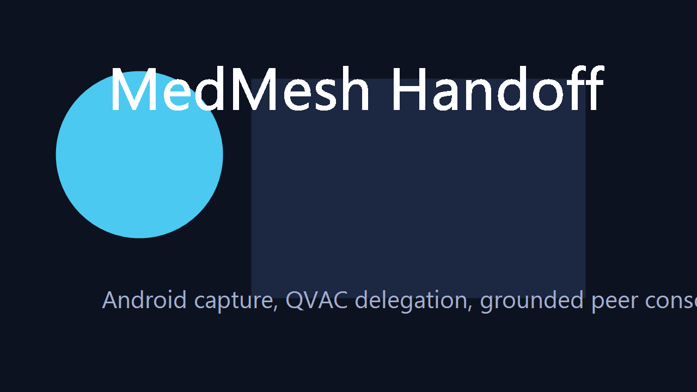

<div align="center">
  
  <h1 align="center">MedMesh Handoff</h1>
  <p align="center">
    Local-first multimodal clinical handoff for Android capture and nearby peer compute.
  </p>
  <p align="center">
    <a href="#about-the-project"><strong>About</strong></a>
    ·
    <a href="#built-with"><strong>Built With</strong></a>
    ·
    <a href="#getting-started"><strong>Getting Started</strong></a>
    ·
    <a href="#qvac-runtime"><strong>QVAC Runtime</strong></a>
    ·
    <a href="#usage"><strong>Usage</strong></a>
  </p>
</div>

## About The Project

[](screenshot.png)

MedMesh Handoff is a privacy-first workflow for field capture and clinical handoff. An Android device collects structured intake, document photos, and a voice note, then hands heavier AI work to a nearby trusted laptop instead of a cloud endpoint.

The system is designed for situations where connectivity is weak, privacy matters, and the receiving clinician still needs a clean, grounded handoff packet. The current product focuses on emergency handoff first, with rural referral and specialist consult presets built on the same shared pipeline.

### Why MedMesh

- Captures a case locally before sending it to the peer
- Delegates OCR and transcription to nearby compute over QVAC
- Produces a structured, non-diagnostic handoff summary
- Grounds follow-up answers against bundled offline protocol references
- Keeps the runtime transparent through pairing state, model status, and evidence logs

## Built With

- `@qvac/sdk`
- `Expo`
- `React Native`
- `React`
- `Vite`
- `Express`
- `TypeScript`
- `pnpm` workspaces

## Architecture

### Workspace

- `apps/mobile` - Android-first capture client for intake, photos, voice notes, and peer transfer
- `apps/peer-ui` - local console for pairing, runtime status, jobs, and exports
- `services/peer-core` - QVAC-backed peer service for provider startup, delegated preprocessing, storage, and exports
- `packages/shared` - shared contracts, presets, runtime types, and disclaimers
- `packages/protocol-pack` - bundled local protocol references used for grounded follow-up
- `qvac/worker.entry.mjs` - custom worker entry used by the QVAC runtime

### Data Flow

1. The phone captures structured intake and attachments locally.
2. The phone pairs with a nearby peer through a short code or QR payload.
3. QVAC handles delegated OCR and speech transcription on the peer.
4. `peer-core` normalizes inputs, assembles a handoff summary, and answers grounded follow-up questions.
5. `peer-ui` exposes job state, runtime health, model status, and export artifacts.

## Getting Started

### Prerequisites

- `Node.js 22+`
- `pnpm 11+`
- `Android` device or emulator for the mobile app
- `Windows` host for the current live QVAC path

If PowerShell blocks `pnpm`, use `pnpm.cmd`.

### Installation

1. Clone the repository.
2. Install workspace dependencies.

   ```powershell
   pnpm install
   ```

3. Copy `services/peer-core/.env.example` to `services/peer-core/.env` if you want to override defaults.

### Start the apps

```powershell
pnpm --filter @medmesh/peer-core dev
pnpm --filter @medmesh/peer-ui dev
pnpm --filter @medmesh/mobile start
```

## QVAC Runtime

MedMesh uses QVAC for local model orchestration and peer-to-peer delegation.

- The Android app acts as the capture client and delegated-work consumer.
- The laptop starts the local QVAC provider used for OCR and transcription.
- The peer exposes requested and effective runtime mode, provider identity, and model status through `peer-ui`.
- The default live path on this machine is the `lite` profile.
- A stronger machine can opt into the `full` profile with MedPsy and embeddings.

### Live profile

Current `lite` profile:

- `WHISPER_TINY`
- `VAD_SILERO_5_1_2`
- `OCR_LATIN_RECOGNIZER_1`

Optional `full` profile additions:

- `MedPsy 1.7B Q4_K_M`
- protocol embeddings

### Helpful environment variables

- `MEDMESH_APP_URL` - base URL used by the phone
- `MEDMESH_QVAC_MODE` - `mock` or `live`
- `MEDMESH_LIVE_PROFILE` - `lite` or `full`
- `MEDMESH_PROVIDER_TOPIC` - fixed provider topic when needed
- `MEDMESH_CTX_SIZE` - context-size tuning for stronger hosts
- `MEDMESH_GPU_LAYERS` - GPU offload tuning for stronger hosts
- `MEDMESH_DEVICE_LABEL` - custom peer label shown in the console
- `MEDMESH_GPU_LABEL` - custom GPU label shown in the console

### Live runtime checks

```powershell
pnpm doctor:live
pnpm prepare:live:dry
pnpm qualify:live-host
```

## Usage

1. Start `peer-core` and open `peer-ui`.
2. Launch the mobile app and enter the peer URL or scan the pairing payload.
3. Capture an emergency handoff case with structured intake, at least one document photo, and a voice note.
4. Save the packet locally, then send it to the peer.
5. Review delegated OCR, delegated transcription, summary output, grounded follow-up, and markdown export in `peer-ui`.

## Validation

```powershell
pnpm typecheck
pnpm build
pnpm validate:mock
pnpm validate:live
```

Additional runtime diagnostics:

```powershell
pnpm capture:hardware
pnpm qualify:live-host:dry
```

## Project Scope

- Non-diagnostic workflow support only
- Emergency handoff as the primary path
- Rural referral and specialist consult as alternate presets
- Local-first storage on the phone and peer
- No required cloud AI dependency
